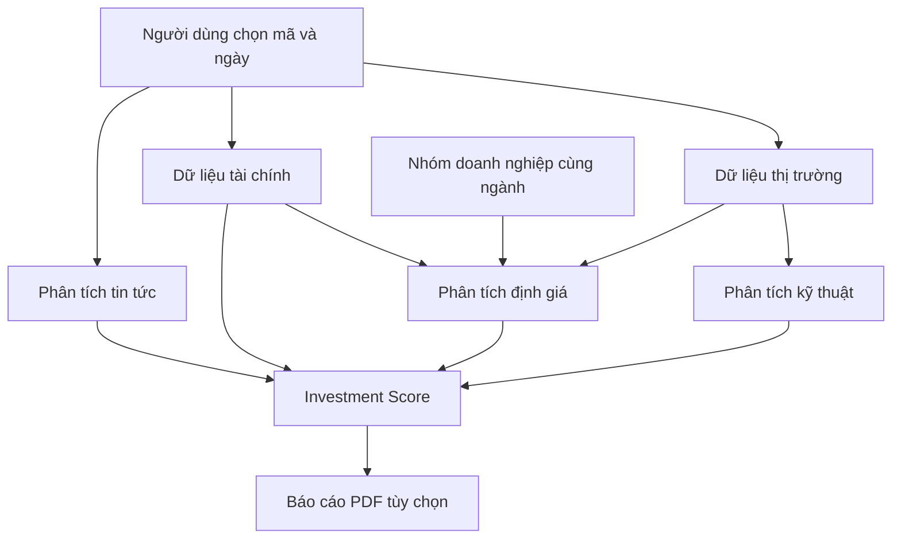

<div align="center">

# 📈 StockLens

### Hệ thống phân tích và đánh giá cơ hội đầu tư cổ phiếu Việt Nam

**Phân tích kỹ thuật • Phân tích tài chính • Định giá tương đối • Phân tích tin tức • Báo cáo tự động**


**Dự án môn Gói phần mềm 1 · Nhóm StockLens**

</div>

---

> **Trạng thái hiện tại:** Dự án đang phát triển và tích hợp. Mô-đun định giá, kỹ thuật và tài chính đã có các tệp mã nguồn trong repository ở các ảnh được cung cấp; việc kết nối nguồn dữ liệu trực tiếp, chọn doanh nghiệp so sánh, tính điểm tổng hợp và xuất PDF cần kiểm thử trước khi tuyên bố hoạt động hoàn chỉnh. Không phải tất cả mã cổ phiếu đều chắc chắn có dữ liệu đầy đủ.

## 🚀 Điểm nổi bật

- **Thiết kế theo mô-đun:** Có thể phát triển và kiểm thử riêng phần thị trường, kỹ thuật, tài chính, định giá và tin tức.
- **Không cố định mã cổ phiếu:** Quy trình nhận mã từ người dùng; phạm vi thực tế phụ thuộc độ phủ nguồn dữ liệu và quyền API.
- **Định giá có thể giải thích:** Tính P/E TTM, BVPS, P/B; đối chiếu nhóm doanh nghiệp cùng ngành và công bố phương pháp Valuation Score.
- **Kiểm soát dữ liệu:** Phân biệt ngày giao dịch, kỳ báo cáo và ngày công bố; không tự tạo giá trị khi thiếu dữ liệu.
- **Cá nhân hóa dự kiến:** Thận trọng, Cân bằng, Tăng trưởng; chọn nội dung báo cáo PDF.
- **Định hướng báo cáo chuyên nghiệp:** Bảng, biểu đồ, nhận xét, nguồn dữ liệu và cảnh báo trong PDF (khi hoàn tất tích hợp).

## 🧭 Hệ thống hoạt động như thế nào?



*Lưu đồ kiến trúc mục tiêu; không phải bằng chứng mọi mắt xích đã chạy thành công.*

## 📊 Các phân hệ

| Phân hệ | Nội dung | Tệp/đầu ra dự kiến |
|---|---|---|
| **Market Data** | OHLCV, ngày giao dịch, chuẩn hóa đơn vị và lỗi nguồn | `market_data.py` |
| **Technical Analysis** | MA20, MA50, RSI, MACD, biểu đồ, Technical Score | `src/technical_analysis.py` |
| **Fundamental Analysis** | Doanh thu, lợi nhuận, ROA, ROE, biên lợi nhuận, nợ, Financial Score | `fundamental_analysis.py` |
| **Valuation Analysis** | P/E, P/B, so sánh cùng ngành, Valuation Score, nhận xét | `src/valuation.py` |
| **Peer Selection** | Lựa chọn doanh nghiệp so sánh theo ngành và thời điểm | `src/peer_selection.py` *(bổ sung nếu chưa có)* |
| **News Analysis** | Thu thập và phân loại cảm xúc tin tức | Đang phát triển |
| **Automated Reporting** | Investment Score theo phong cách, tạo PDF | Đang tích hợp |

### 🔍 Phân tích định giá

Các công thức lõi:

```text
P/E = Giá cổ phiếu / EPS TTM
BVPS = Vốn chủ sở hữu thuộc cổ đông phổ thông / Số cổ phiếu phổ thông đang lưu hành
P/B = Giá cổ phiếu / BVPS
```

- Chỉ tính P/E thông thường khi EPS TTM dương; chỉ dùng P/B khi BVPS dương.
- Dữ liệu báo cáo dùng để định giá lịch sử phải **được công bố không muộn hơn ngày định giá**.
- So sánh các bội số với nhóm ngành phù hợp và đủ quan sát hợp lệ.
- **Valuation Score** là thang điểm tương đối 0–100 do nhóm thiết kế, **không phải giá trị nội tại, xác suất tăng giá hoặc tín hiệu mua/bán**.
- Khi thiếu EPS, BVPS, dữ liệu cùng ngành hoặc nguồn truy cập, hệ thống phải hiển thị thiếu dữ liệu thay vì tự gán 0 hoặc 100.

Giao diện hàm của:

```python
from src.valuation import analyze_valuation

result = analyze_valuation(price, financial_df, peers_df)
print(result['pe'], result['pb'], result['valuation_score'])
```

`price`, `financial_df`, `peers_df` phải được chuẩn hóa từ nguồn dữ liệu thật trước khi gọi; đoạn này minh họa API lập trình, không phải lệnh chạy độc lập.

## 📁 Cấu trúc mã nguồn

Cấu trúc định hướng, dựa trên những thư mục/tệp nhóm đã chia sẻ; có thể thay đổi khi tích hợp:

```text
StockLens/
├── data/
│   ├── financial/             # Dữ liệu tài chính nhóm cung cấp
│   ├── symbols.csv            # Danh mục mã nếu được nhóm duy trì
│   └── valuation/             # Danh mục ngành/nhóm so sánh (dự kiến)
├── src/
│   ├── technical_analysis.py
│   ├── test_technical.py
│   ├── valuation.py
│   ├── test_valuation.py
│   └── peer_selection.py      # Cần đưa lên repo nếu chưa có
├── fundamental_analysis.py
├── interface_to_tv1_tv3.py
├── market_data.py            # Vị trí cần xác nhận từ repo hiện tại
├── requirements.txt          # Danh sách thư viện cần duy trì
├── README.md
└── .gitignore
```

> **Chú ý:** Không tự ý thay đổi đường dẫn của file các thành viên đang sử dụng. Đặc biệt, cần chỉnh import theo đúng vị trí `market_data.py` và `fundamental_analysis.py` trong repository thực tế.

## 💻 Cài đặt và chạy từ A–Z

### Bước 1 — Chuẩn bị môi trường

- Python 3.10+ (kiểm tra tương thích với các thư viện thực tế).
- Git và VS Code (khuyến nghị).
- Quyền truy cập nguồn dữ liệu tương ứng, nếu module cần API.

### Bước 2 — Tải dự án

**Cách A: GitHub → Code → Download ZIP**, giải nén và mở cả thư mục `StockLens` trong VS Code.

**Cách B: Git Clone**

```bash
git clone https://github.com/hoanttk24414-max/StockLens.git
cd StockLens
```

### Bước 3 — Tạo môi trường ảo

**macOS / Linux**

```bash
python3 -m venv .venv
source .venv/bin/activate
python -m pip install --upgrade pip
```

**Windows (PowerShell)**

```powershell
py -m venv .venv
.venv\Scripts\Activate.ps1
python -m pip install --upgrade pip
```

### Bước 4 — Cài các thư viện

Nếu repository có **tệp** `requirements.txt` hợp lệ:

```bash
python -m pip install -r requirements.txt
```

Nếu chưa có tệp này, nhóm cần tạo và bổ sung thư viện thực tế (`pandas`, `numpy`, `requests`, cùng các gói cần cho giao diện/báo cáo khi hoàn thiện). **Không cài đặt bằng cách chạy một thư mục mang tên `requirements.txt`.**

### Bước 5 — Kiểm tra module TV4

Chạy từ **thư mục gốc** `StockLens`:

```bash
python -m unittest discover -s src -p "test_valuation.py" -v
```

Nếu file test còn import `from valuation import ...` trong khi module nằm dưới `src/`, đổi thành:

```python
from src.valuation import analyze_valuation, calculate_pe, calculate_pb
```

Lệnh test chỉ kiểm tra thuật toán và dữ liệu giả lập; **không xác nhận API thị trường hoạt động**.

### Bước 6 — Chạy hệ thống sau khi tích hợp

Khi nhóm có file khởi chạy/giao diện hoàn chỉnh, làm theo hướng dẫn `main.py` được cập nhật trong repository. Hiện chưa thể cam kết có một lệnh chạy toàn hệ thống hay xuất PDF thành công.

## 🧪 Kiểm thử và cách nhận biết trạng thái

| Kết quả | Ý nghĩa |
|---|---|
| `Ran N tests ... OK` với N > 0 | Các test được phát hiện và đã vượt qua |
| `Ran 0 tests` / `NO TESTS RAN` | Chưa phát hiện bài test; **không phải** kết quả kiểm thử thành công |
| `401 Unauthorized` | API từ chối xác thực; kiểm tra token, quyền, endpoint và cách dùng header |
| `ModuleNotFoundError` | Chưa cài dependency hoặc đường dẫn import chưa đúng |
| `Empty DataFrame` | Không có dữ liệu hợp lệ; không được suy ra Valuation Score |

## 🔐 Cấu hình và bảo mật API

**Không commit API key, secret, Bearer token hoặc file `.env` lên GitHub**, kể cả với repository public phục vụ môn học. Nếu thông tin xác thực đã bị lộ trên GitHub/ảnh chụp, cần thu hồi và tạo mới.

Mẫu `.env.example` (chỉ tên biến, không chứa thông tin thật):

```dotenv
DNSE_API_KEY=
DNSE_ACCESS_TOKEN=
```

Các API endpoint, quyền truy cập, giới hạn và cách xác thực cần đối chiếu với tài liệu chính thức của nhà cung cấp. Token truy cập không nhất thiết là API secret.

## 🛠️ Xử lý sự cố thường gặp

**1. `No such file or directory`** — dùng `pwd`, `ls` để bảo đảm Terminal đang ở thư mục dự án và file thực sự tồn tại.

**2. `permission denied` khi gõ đường dẫn `.py`** — gọi bằng `python path/to/file.py`, không gõ đường dẫn script như một lệnh shell.

**3. `Ran 0 tests`** — lưu file; kiểm tra tên `test_*.py`, tên hàm `test_*`, `unittest.TestCase` và đường dẫn `-s`.

**4. `401 Unauthorized`** — đây là vấn đề xác thực của nguồn dữ liệu; kiểm tra cấu hình an toàn, không dán token vào ảnh/log.

**5. `Valuation Score = None`** — kiểm tra ngày giá, ngày công bố BCTC, EPS/BVPS và số lượng doanh nghiệp cùng ngành hợp lệ. Không coi `None` là điểm 0.

## 📚 Nguồn dữ liệu và phương pháp

- **Giá chứng khoán:** nguồn mà TV1 tích hợp, kèm ngày, nguồn và độ trễ; tình trạng endpoint/API phải được xác minh.
- **BCTC và thông tin doanh nghiệp:** công bố của doanh nghiệp/sở giao dịch hoặc nguồn được TV3 kiểm chứng; phân biệt ngày kết thúc kỳ và ngày công bố.
- **Phân loại ngành:** danh mục mã/ngành có nguồn, phiên bản và ngày cập nhật để phục vụ chọn doanh nghiệp tương đồng.
- **Phương pháp điểm:** quy tắc nội bộ của StockLens, minh bạch về giả định và giới hạn.

**Tham khảo công cụ khai thác báo cáo:** [Tumiqa/vn-annual-report-miner](https://github.com/Tumiqa/vn-annual-report-miner). Đây là nguồn tham khảo phương pháp và dữ liệu, không phải thành phần StockLens đã tích hợp mặc định.

## 👥 Thành viên và phân công

| Thành viên | Trách nhiệm |
|---|---|
| **Nhã** | Thu thập và chuẩn hóa dữ liệu thị trường |
| **Hoàn** | Phân tích kỹ thuật và Technical Score |
| **Hà** | Phân tích tài chính và Financial Score |
| **Linh** | Phân tích định giá, P/E, P/B và Valuation Score |
| **Hưng** | Phân tích tin tức và News Score |
| **Thư** | Giao diện, tích hợp, Investment Score, PDF |

## ⚠️ Giới hạn và tuyên bố miễn trừ

StockLens là dự án học tập và nghiên cứu. Các chỉ số và điểm số không phải khuyến nghị đầu tư cá nhân hóa hoặc cam kết lợi nhuận. Dữ liệu có thể thiếu, cập nhật trễ, sai khác đơn vị hoặc chịu ảnh hưởng điều chỉnh cổ phiếu. Người sử dụng cần kiểm chứng nguồn và thời điểm trước khi diễn giải kết quả.

---

<div align="center">

**StockLens — Nhìn dữ liệu rõ hơn, đánh giá cơ hội đầu tư có cơ sở hơn.**

*Dự án học phần Gói phần mềm 1 · Đang phát triển*

</div>
